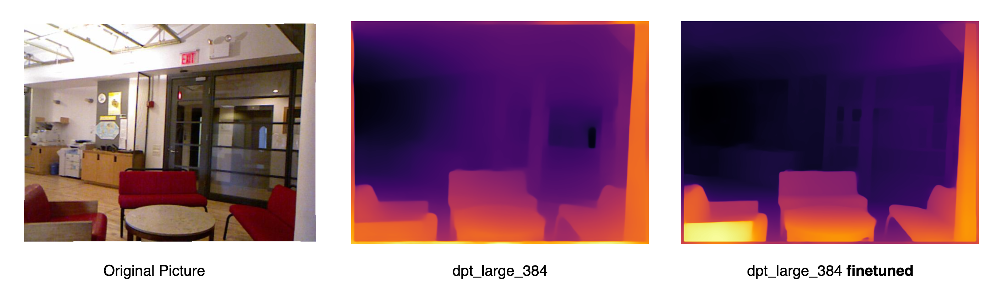

## Finetune & Evaluation on MiDaS

### Introduction
To run the original MiDaS code, please refer to [isl-org/MiDaS](https://github.com/isl-org/MiDaS).

This repository contains the code for [finetune](finetune) and [evaluation](eval) on MiDaS. We use [LoRA](https://github.com/microsoft/LoRA) for finetuning, and multiple metrics for evaluating. 

Thanks to developers in [this gist](https://gist.github.com/dvdhfnr/732c26b61a0e63a0abc8a5d769dbebd0), we refer to their implementation of the loss functions. For evaluation, we refer to the code provided [here](https://github.com/isl-org/DPT/blob/main/EVALUATION.md).

### Guidance

Please read [this documentation](finetune/README.md) for detailed instructions. ATTENTION! This code can only finetune Transformer-based models, e.g., dpt_large_384.

Before you finetune MiDaS, please make sure to properly set up the environment and download the weights according to the instructions in the [original repository](https://github.com/isl-org/MiDaS). 

### Results

We finetuned dpt_large_384 on the [NYU Depth V2](https://www.kaggle.com/datasets/soumikrakshit/nyu-depth-v2) dataset, and the results are as follows: 

| Model | d1 $\uparrow$ | AbsRel $\downarrow$ | RMSE $\downarrow$ | SILog $\downarrow$ |
| :--- | :--- | :--- | :--- | :--- |
| dpt_large_384 | 0.796 | 0.155 | 0.529 | 23.952 |
| finetuned | 0.831 | 0.135 | 0.447 | 22.017 |

We also provide a case study below:

### License

Our finetune and evaluation code is under the [MIT license](finetune/LICENSE).

### Acknowledgement

We thank all the developers of MiDaS for their awesome work.